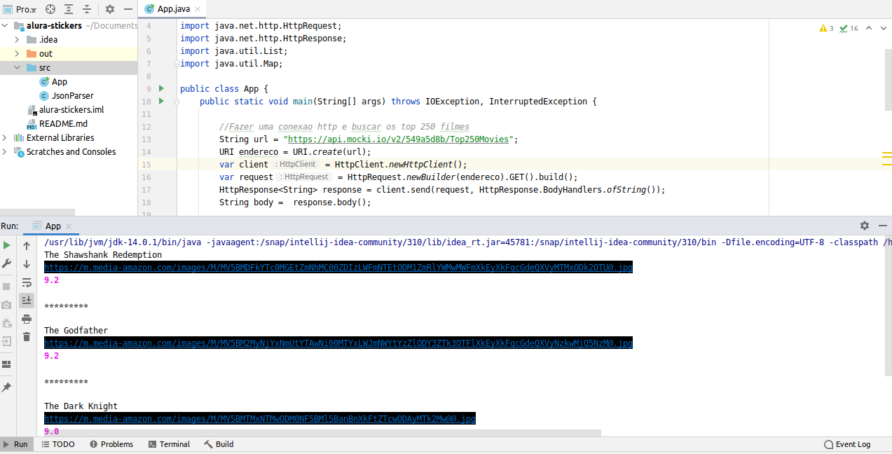

# Imersão Alura - alura-stickers

[](https://travis-ci.org/codecentric/springboot-sample-app)
[](https://coveralls.io/github/codecentric/springboot-sample-app?branch=master)
[](http://www.apache.org/licenses/LICENSE-2.0.html)

## Requirements

For building and running the application you need:

- [JDK 14](http:/https://www.oracle.com/java/technologies/javase/jdk14-archive-downloads.html)

## Running the application locally

There are several ways to run a Java application on your local machine. One way is to execute the `main` method in the `RUN` APP class from your IDE.


```shell
javac APP.java
```


